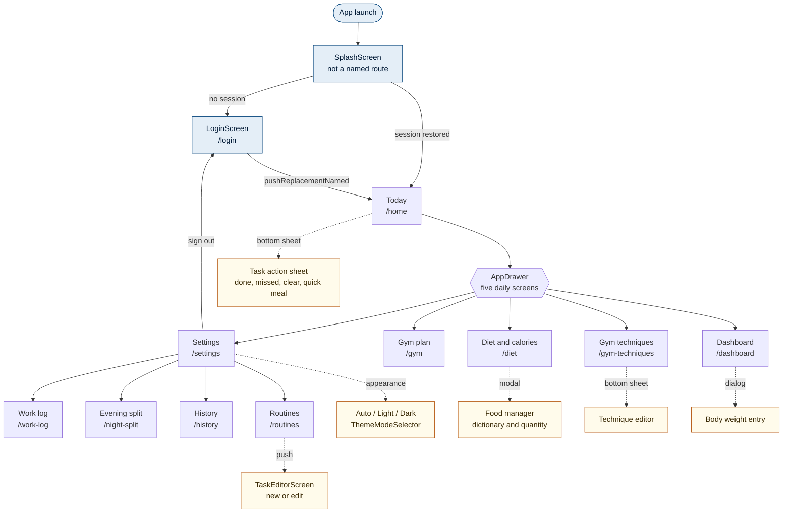
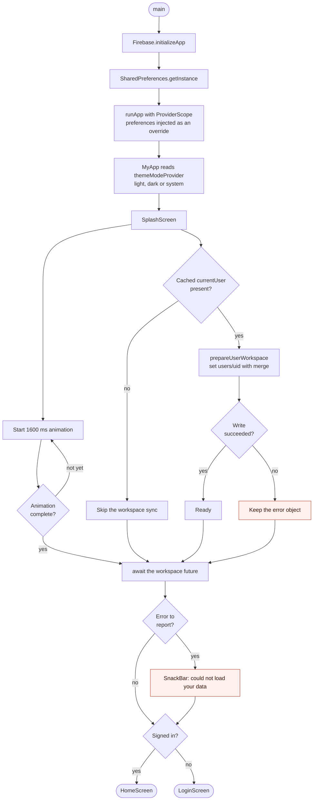
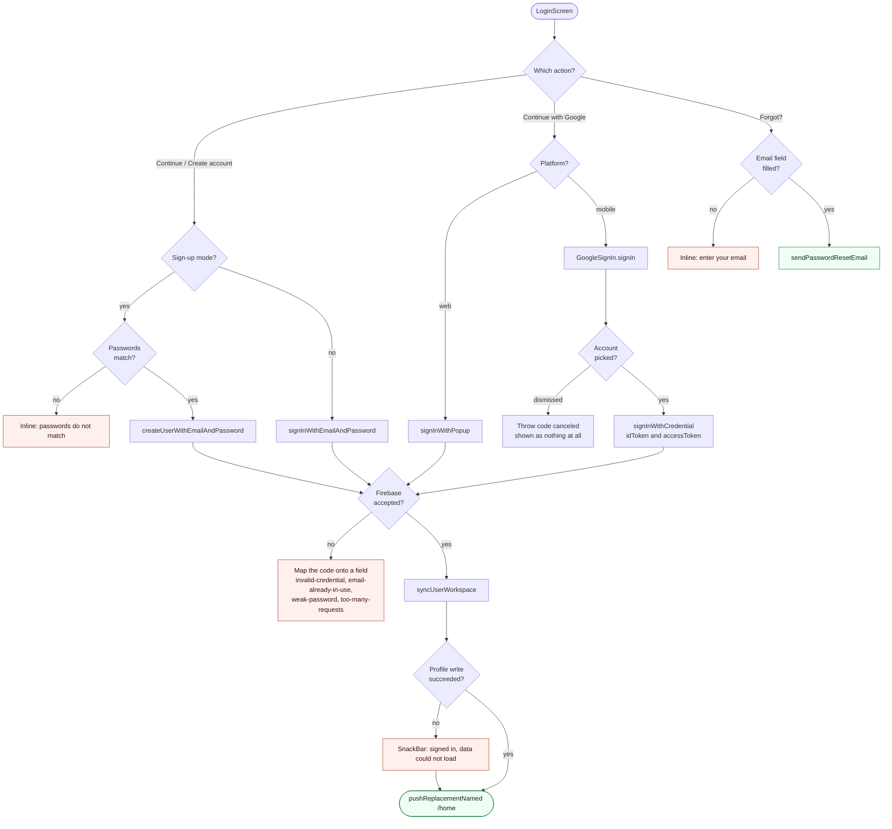
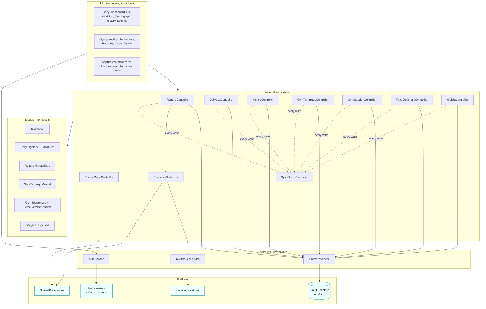
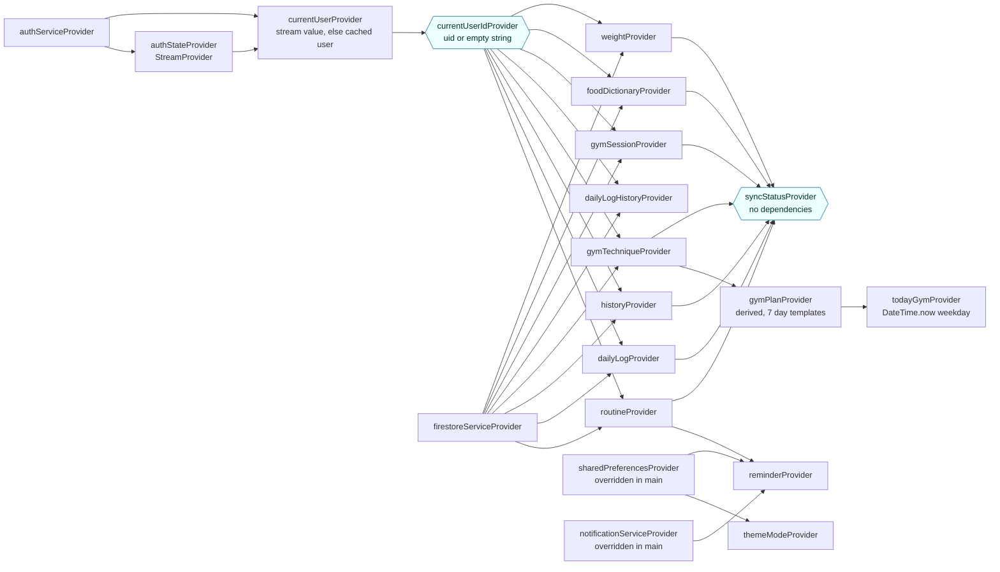
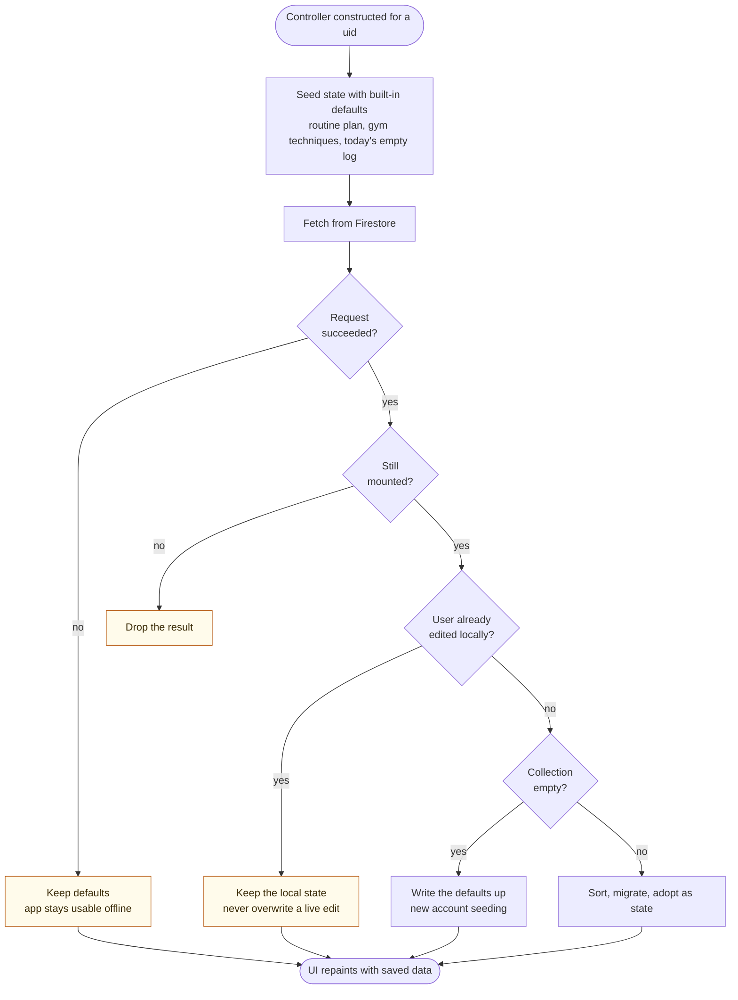
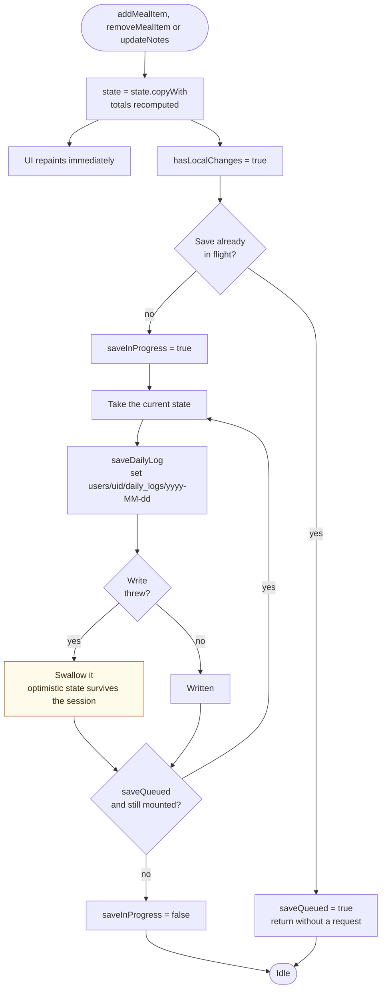
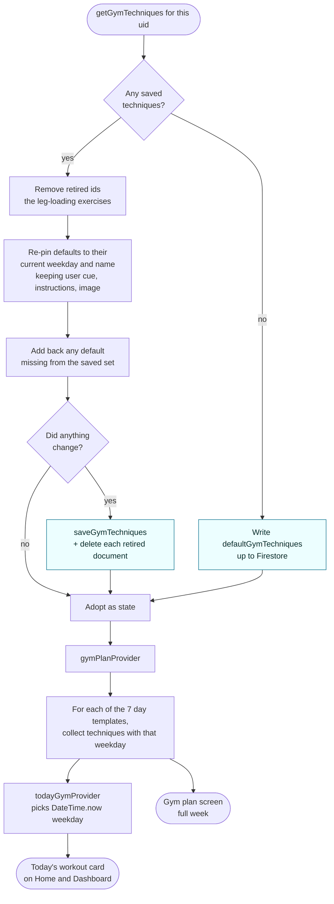
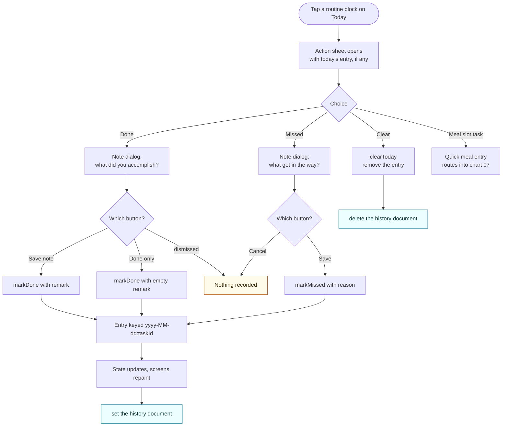

# RoutineSync — flowcharts

Structure and decisions, drawn from the code in `lib/`. Where
[`sequence-diagrams.md`](sequence-diagrams.md) shows *who talks to whom over time*, this file shows
*what the app is made of* and *which branch it takes*.

Diagrams are Mermaid and render on GitHub.

> **Opening these in a Mermaid viewer?** Feed it a single diagram, not this whole file — a
> Mermaid-only renderer reads the first line (`# RoutineSync — flowcharts`) and reports
> *"No diagram type detected"*. Each diagram is also saved on its own in
> [`diagrams/`](diagrams/), ready to paste into mermaid.live or a plugin.

| # | Chart |
| --- | --- |
| 01 | [Screen and navigation map](#01--screen-and-navigation-map) |
| 02 | [Launch and routing decision](#02--launch-and-routing-decision) |
| 03 | [Sign-in decision tree](#03--sign-in-decision-tree) |
| 04 | [Layers: widget to Firestore](#04--layers-widget-to-firestore) |
| 05 | [Provider dependency graph](#05--provider-dependency-graph) |
| 06 | [Controller hydration decision](#06--controller-hydration-decision) |
| 07 | [The daily-log save queue](#07--the-daily-log-save-queue) |
| 08 | [Gym technique migration and plan derivation](#08--gym-technique-migration-and-plan-derivation) |
| 09 | [Marking a routine](#09--marking-a-routine) |

---

## 01 — Screen and navigation map

Eleven routes, all resolved by `onGenerateRoute` in `lib/main.dart`. The drawer is the hub: every
destination is reached with `pushReplacementNamed`, so the back stack never stacks up. Only the task
editor is a real `push`.

The drawer carries only the five screens opened daily. Everything occasional — work log, evening
split, history, routines — plus appearance and sign-out sits one level down on `/settings`.

- Every screen except the splash and the task editor pulls in `AppDrawer` with its own
  `currentRoute`, which is what drives the selected state.
- `_buildAppRoute` returns `null` for an unrecognised name and no `onUnknownRoute` is configured, so
  route names are effectively a closed set defined by `AppRoutes`.

---

## 02 — Launch and routing decision

The branch that decides whether you ever see the login screen. Note that both the animation and the
workspace sync have to finish — whichever is slower sets the timing.

---

## 03 — Sign-in decision tree

One screen, two modes, two providers, and a table of Firebase error codes mapped onto specific
fields rather than a generic failure message.

---

## 04 — Layers: widget to Firestore

Screens never touch the Firebase SDKs. Everything crosses two boundaries: a Riverpod controller that
owns state, and a service that owns the SDK call.

- `json_serializable` generates the `toJson` / `fromJson` on most models; the `.g.dart` files are
  build output and are never edited by hand. `GymDayModel`, `GymSessionLog` and `WeightEntryModel`
  map themselves by hand, so adding a field to them needs no code generation run.
- Every controller that writes reports the result into `SyncStatusController`. Optimistic local state
  is unchanged — the difference is that a failure is now countable and retryable rather than silent.
- `FirestoreService` treats an empty user id as "signed out" and no-ops, which is what makes the
  sign-out frame safe.

---

## 05 — Provider dependency graph

`currentUserIdProvider` is the hinge. Everything that persists watches it, so changing accounts
disposes the old controllers and rebuilds them against the new tree.

`syncStatusProvider` is the second hinge: it depends on nothing, so every controller can report a
failed write into it without creating a cycle. `reminderProvider` watches the routine list, which is
what reschedules notifications when a routine is renamed, retimed or deleted.

---

## 06 — Controller hydration decision

The same shape runs in `RoutineController`, `GymTechniqueController`, `HistoryController` and
`DailyLogController`: state is useful immediately, and the network result is adopted only if it is
still safe to do so.

---

## 07 — The daily-log save queue

One document holds the whole day, and four screens edit it. `DailyLogController` coalesces writes so
fast typing cannot open a queue of overlapping requests.

The loop re-reads `state` each pass, so the last write always carries the newest version of the day —
intermediate edits are skipped rather than queued one by one.

---

## 08 — Gym technique migration and plan derivation

The weekly plan is computed, never stored. Saved techniques are cleaned up on load so an old account
converges on the current plan without losing the cues and images the user wrote.

Technique ids are stable across plan changes, which is why a cue written for an exercise follows it
when the exercise moves to a different training day.

---

## 09 — Marking a routine

Two taps and an optional note. The distinction that matters: **Done only** records a completion with
an empty remark, while dismissing the dialog records nothing at all.

Because the key contains the date, marking the same task twice in one day overwrites the earlier
entry instead of creating a second one.
