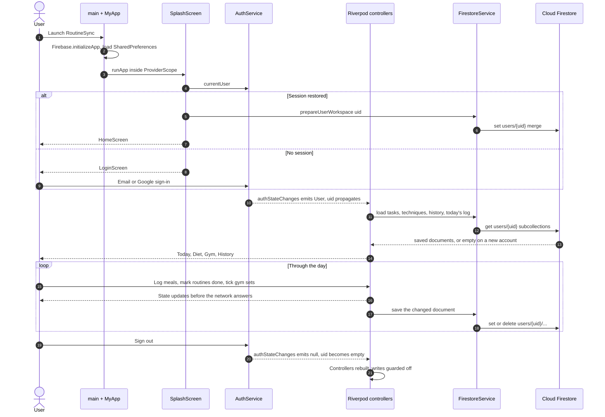
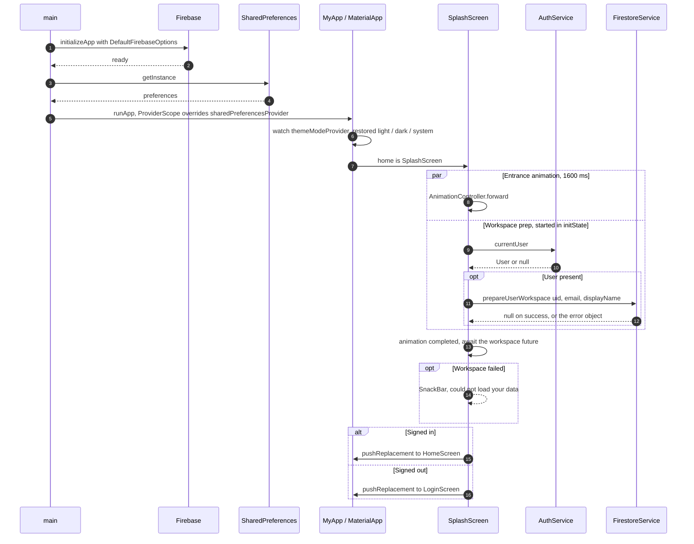
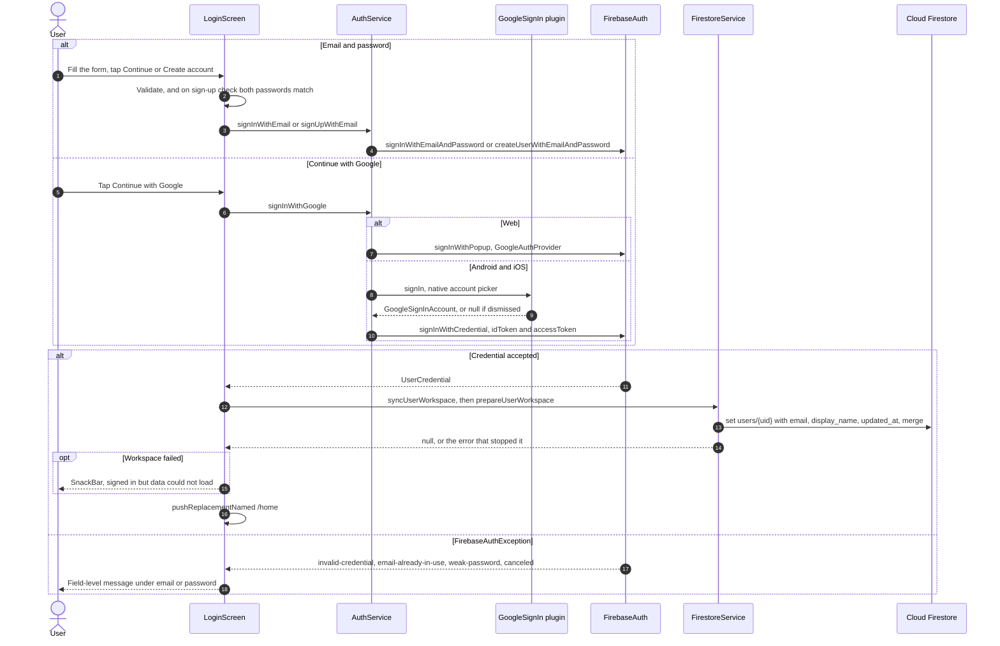
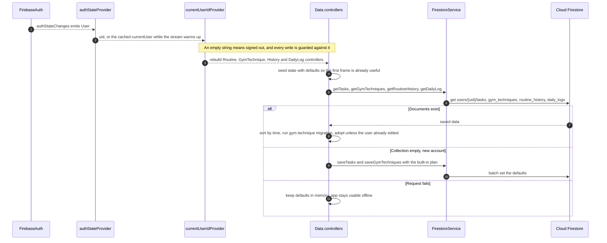
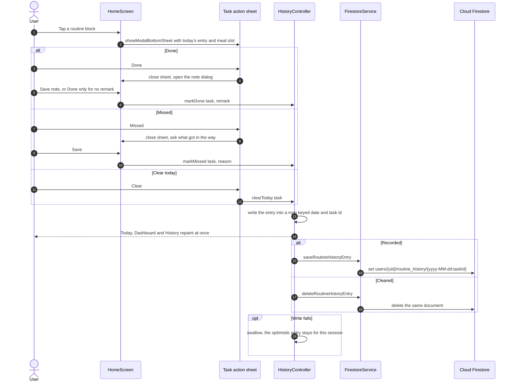
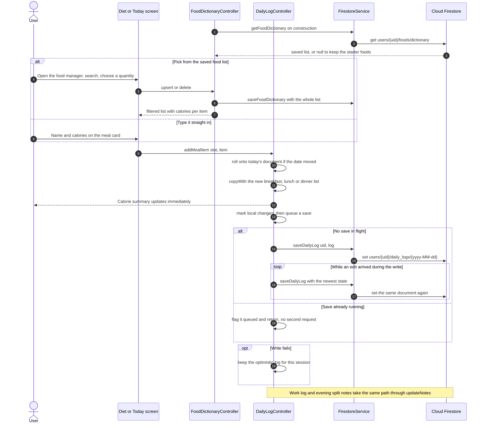
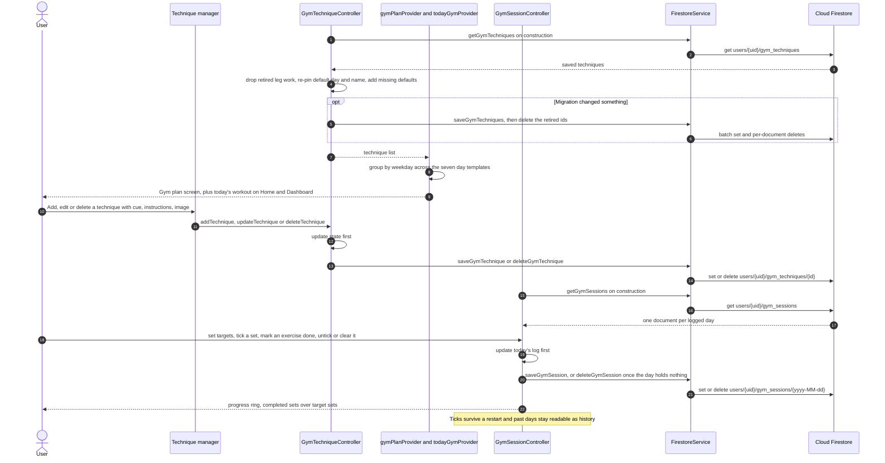
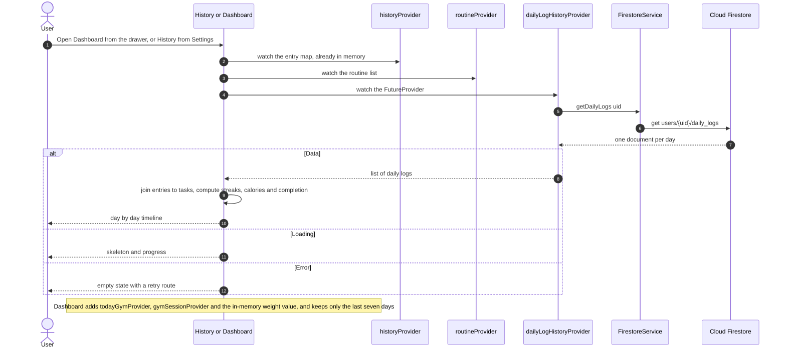
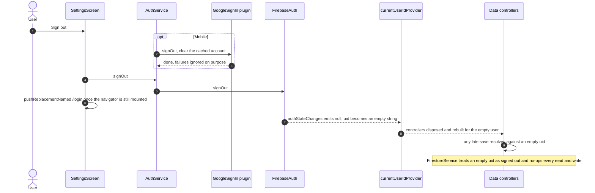

# RoutineSync — full process in sequence

Sequence diagrams traced from the code in `lib/`, in runtime order: from the first frame of the
splash screen to the moment sign-out empties the user id and every Firestore write becomes a no-op.

Diagrams are Mermaid and render on GitHub. Theme colours are deliberately left to the renderer so
they read in both light and dark.

For the structural view — route map, layers, provider graph and the branch-by-branch decisions —
see [`flowcharts.md`](flowcharts.md).

> **Opening these in a Mermaid viewer?** Feed it a single diagram, not this whole file — a
> Mermaid-only renderer reads the first line (`# RoutineSync — full process in sequence`) and reports
> *"No diagram type detected"*. Each diagram is also saved on its own in
> [`diagrams/`](diagrams/), ready to paste into mermaid.live or a plugin.

| Stage | Flow |
| --- | --- |
| — | [One session, end to end](#one-session-end-to-end) |
| 01 | [Cold start and the splash gate](#01--cold-start-and-the-splash-gate) |
| 02 | [Signing in, two ways](#02--signing-in-two-ways) |
| 03 | [Provider hydration: uid in, data out](#03--provider-hydration-uid-in-data-out) |
| 04 | [Marking a routine done or missed](#04--marking-a-routine-done-or-missed) |
| 05 | [Meals, notes, and the save queue](#05--meals-notes-and-the-save-queue) |
| 06 | [Gym plan, technique library, live session](#06--gym-plan-technique-library-live-session) |
| 07 | [Reading it back: history and dashboard](#07--reading-it-back-history-and-dashboard) |
| 08 | [Sign out and account teardown](#08--sign-out-and-account-teardown) |
| — | [Where the data lands](#where-the-data-lands) |

---

## One session, end to end

The condensed path a single user takes through the app. Every arrow here is expanded in one of the
eight stages below.

---

## 01 — Cold start and the splash gate

`main` resolves Firebase and SharedPreferences before the first frame, so the saved theme is already
known when the splash paints. The splash then runs the network round trip *alongside* its 1.6 second
animation rather than after it.

**Files:** `lib/main.dart:22` · `lib/screens/splash_screen.dart:33` · `lib/providers/theme_provider.dart:13` · `lib/providers/auth_provider.dart:41`

- **Why:** preferences are read before `runApp` so the splash never flashes the wrong appearance for a frame.
- The route is chosen from the *cached* `currentUser`, not from the auth stream — a persisted session skips the login screen entirely.
- **Failure path:** a rejected profile write (undeployed security rules, for instance) still lets you in, but surfaces as a snackbar rather than vanishing silently.

---

## 02 — Signing in, two ways

Email/password and Google both land on the same finish line: a `UserCredential`, a profile document,
then `/home`. Google takes the native picker on mobile and a popup on web, because Android
special-cases `google.com` and fails the redirect flow.

**Files:** `lib/screens/login_screen.dart:311` · `lib/services/auth_service.dart:44` · `lib/providers/auth_provider.dart:41`

- **Why:** Google is a verified provider, so signing in with an address that already has a password account links them and keeps the same uid — and therefore the same data.
- Dismissing the account picker is turned into a `canceled` exception and deliberately shows no error.
- **Watch:** a missing SHA-1 fingerprint surfaces as a `PlatformException` (ApiException: 10), caught separately from auth errors.

---

## 03 — Provider hydration: uid in, data out

`currentUserIdProvider` is the hinge of the whole app. Every data controller watches it, so a new uid
tears the old controllers down and rebuilds them against the new account's collections. Each one
seeds itself with built-in defaults first, so no screen is ever blank while Firestore answers.

**Files:** `lib/providers/auth_provider.dart:12` · `lib/providers/routine_provider.dart:63` · `lib/providers/gym_provider.dart:114` · `lib/providers/diet_provider.dart:93` · `lib/providers/history_provider.dart:78`

- **Why:** every controller checks `_hasLocalChanges` before adopting a Firestore result, so a fetch that lands late never overwrites something you just typed.
- `currentUserProvider` falls back to the SDK's cached user while the stream delivers its first value, so a restart never flickers through a signed-out state.

---

## 04 — Marking a routine done or missed

Tapping a block on Today opens an action sheet, then a note dialog. The entry is written to state
first and pushed to Firestore after — the timeline never waits on the network.

**Files:** `lib/screens/home_screen.dart:133` · `lib/providers/history_provider.dart:33` · `lib/services/firestore_service.dart:173`

- **Why:** the document id is `yyyy-MM-dd:taskId`, so re-marking the same task on the same day overwrites rather than duplicating.
- Meal-slot tasks (`breakfast`, `lunch`, `dinner`) get a quick meal entry card in the same sheet, which routes into stage 05.

---

## 05 — Meals, notes, and the save queue

The day's log is one document. Because meals, work notes, study notes and evening notes all mutate
it, `DailyLogController` coalesces writes: while a save is in flight, further edits set a flag
instead of firing a second request, and the loop re-saves the newest state.

**Files:** `lib/providers/diet_provider.dart:108` · `lib/widgets/food_manager_modal.dart:147` · `lib/screens/work_log_screen.dart:69` · `lib/screens/night_split_screen.dart:75`

- **Why:** one document per calendar day (`yyyy-MM-dd`) keeps history a simple collection read — see stage 07.
- The controller's date is re-checked before every edit and whenever the app resumes, so a session left open overnight starts a new document instead of writing this morning's breakfast into yesterday.
- **Watch:** a saved dictionary replaces the starter foods wholesale rather than merging with them — otherwise deleting a built-in food would bring it back on the next launch.

---

## 06 — Gym plan, technique library, live session

The weekly plan is derived, not stored: seven day templates are filled by grouping saved techniques
on `weekday`. Loading also migrates old data — retired leg exercises are removed, defaults are
re-pinned to their current day and name, and missing ones are added back.

**Files:** `lib/providers/gym_provider.dart:16` · `lib/providers/gym_provider.dart:114` · `lib/providers/gym_session_provider.dart:8` · `lib/screens/gym_technique_manager_screen.dart:72`

- **Why:** technique ids are stable across plan changes, so a saved cue, instruction or image follows an exercise when it moves to another training day.
- `total_volume_kg` is derived from the exercise list and written anyway, the same call `DailyLogModel` makes with `total_calories`: it keeps the day's headline number readable straight out of the document.
- **Watch:** a day's document is deleted once every set is unticked and the targets are back at their defaults, so an emptied day does not linger as a blank history entry.

---

## 07 — Reading it back: history and dashboard

Nothing new is fetched per screen — history and dashboard compose the same providers other screens
write to, plus one `FutureProvider` that pulls the full run of daily logs.

**Files:** `lib/screens/history_screen.dart:24` · `lib/screens/dashboard_screen.dart` · `lib/providers/diet_provider.dart:17`

- History entries already live in memory from stage 04, so only the calorie history costs a round trip.
- The dashboard's seven-day strip lists only dates that hold a routine entry or a logged meal, so days before the account existed never show as `0/5`.
- **Watch:** the dashboard's body weight is a plain `StateProvider` defaulting to 190 lb — it is not saved anywhere.

---

## 08 — Sign out and account teardown

Signing out clears the cached Google account before Firebase's, so the next sign-in shows the picker
instead of silently reusing the account that just left. The uid then empties, which is what actually
disconnects the data layer.

**Files:** `lib/screens/settings_screen.dart` · `lib/services/auth_service.dart:74` · `lib/services/firestore_service.dart:14`

- **Why:** Firestore rejects an empty document id, and a widget can rebuild for a frame mid-sign-out — the empty-uid guard is what stops that frame from throwing.
- Signing in as a different account follows the same path in reverse: new uid, new controllers, stage 03 again.

---

## Where the data lands

One tree per account, keyed by Firebase uid. The rules in `firestore.rules` allow read and write only
when `request.auth.uid` matches the `{userId}` in the path, and deny everything outside `/users`.

| Path | Document id | Written by |
| --- | --- | --- |
| `users/{uid}` | uid | Profile: email, display name, server timestamp — refreshed on every sign-in |
| `users/{uid}/tasks` | task id | Routine manager; seeded with the built-in day plan on a new account |
| `users/{uid}/daily_logs` | `yyyy-MM-dd` | Meals, work notes, study and gaming notes — one document per day |
| `users/{uid}/routine_history` | `yyyy-MM-dd:taskId` | Done / missed status with an optional remark |
| `users/{uid}/gym_techniques` | technique id | Weekday, name, cue, instructions, image URL |
| `users/{uid}/gym_sessions` | `yyyy-MM-dd` | Per-exercise target, working weight and ticked sets, plus the day's `total_volume_kg` |
| `users/{uid}/foods` | `dictionary` | The food list offered when logging a meal, as one array |
| `users/{uid}/weight_log` | `yyyy-MM-dd` | One body-weight reading per day, the dashboard trend line |

Every collection above is keyed to the account, so all of it survives a reinstall. Nothing the user
enters is memory-only any more — the body weight was the last holdout and now lives in `weight_log`.

### How much is read

Each history read is bounded by `FirestoreService.historyWindowDays` (90). `daily_logs`,
`gym_sessions` and `weight_log` order by document id — which is the date — and take a limit;
`routine_history` filters on its stored `date` field. Opening the app used to cost the whole of every
collection, which grew with every day of use.

### What is watched rather than fetched

Today's `daily_logs` document and today's `gym_sessions` document are followed with `snapshots()`, so
a meal or a ticked set from another device lands without a restart. Both controllers ignore incoming
snapshots while one of their own writes is still in flight, and both re-point at the new document when
the day rolls over. Everything else is still a one-shot read: the routine list, technique library and
day plan change rarely, and a stale one is corrected on the next launch.

### When a write fails

`SyncStatusController` (`lib/providers/sync_status_provider.dart`) wraps every save. Controllers still
apply their change locally first and never block on the network, but a failure is now recorded against
the document's key instead of being swallowed. `SyncBanner`, wrapped around the navigator in
`MaterialApp.builder`, shows the count with a retry on any screen, and the Settings account card
reports the same state calmly. Retrying re-runs the stored operation, which reads the controller's
current state — so a retry always sends the newest version, not the one that failed.

### Reminders

`NotificationService` schedules one weekly notification per routine per weekday it runs on, built from
the `startTime` label the routine already carries. `ReminderController` listens to `routineProvider`,
so renaming, retiming or deleting a routine reschedules on its own, and it stores the on/off choice in
`SharedPreferences` beside the theme. Alarms are inexact on purpose, which avoids Android's
exact-alarm permission; a refused permission leaves the switch off and says so.
